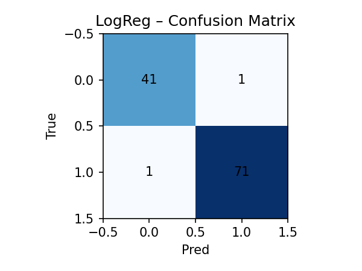
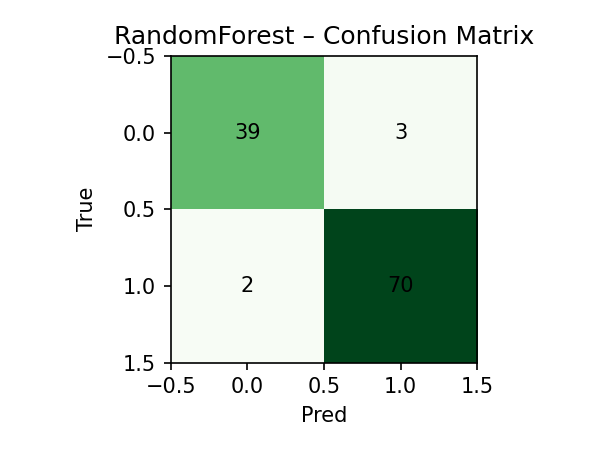
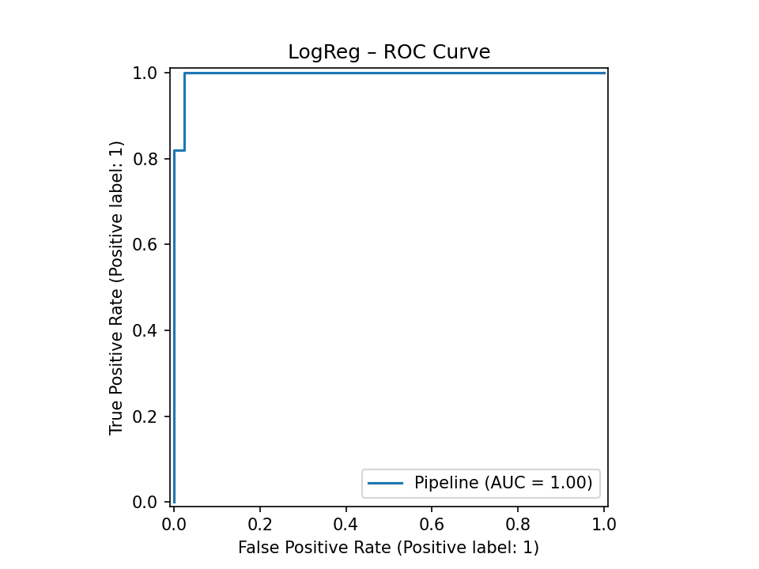
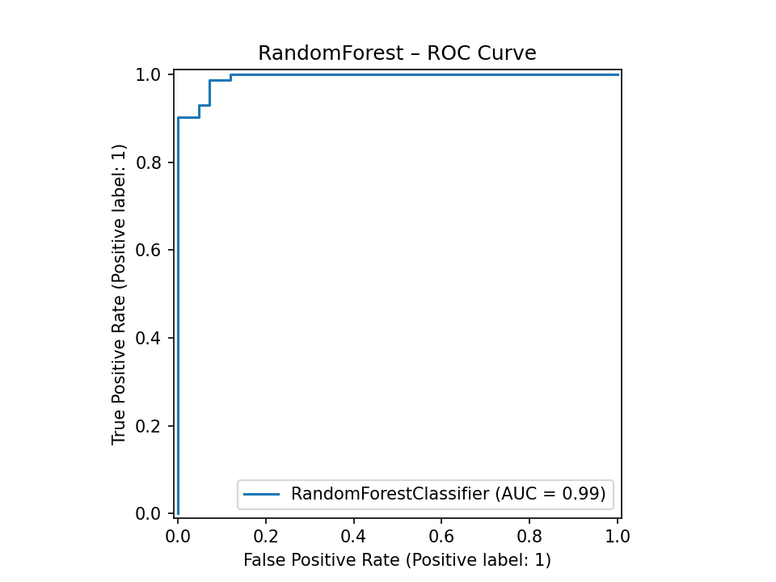

Data Science & Artificial Intelligence — Summary

This repository contains three mini case studies that together cover the core concepts of the course Data Science and Artificial Intelligence:

Data Science (DS): problem → data → preparation → model → validation → conclusion

Artificial Intelligence (AI): neural networks (MLP) applied to real-world datasets

Natural Language Processing (NLP): text vectorization and classification

1) DS Lifecycle (Breast Cancer)

Goal: Binary classification (malignant vs benign tumors).

Techniques: Standardization, Logistic Regression, Random Forest.

Validation: Stratified 5-fold CV + hold-out test set (macro-F1, accuracy, ROC AUC, confusion matrix).

Repository path: case_studies/ds_lifecycle/01_pipeline_breast_cancer.ipynb

Takeaway: Even simple, transparent m*odels can achieve excellent results when features are highly informative.

Confusion matrix provides detailed insight into per-class errors, which is crucial for model evaluation and interpretability.

### Example Results

**Confusion Matrix – Logistic Regression**  

**Confusion Matrix – Random Forest**  

**ROC Curve – Logistic Regression**  

**ROC Curve – Random Forest**  

2) AI / Deep Neural Network (Digits MLP)

Goal: Classification of 8×8 digit images.

Model: MLP (scikit-learn), pipeline with feature scaling.

Validation: Stratified 5-fold CV + test; metrics and plots saved for reproducibility.

Execution: python scripts/run_digits_mlp.py

Takeaway: A small MLP serves as an excellent “bridge” toward deeper models (CNN), demonstrating core AI principles such as non-linear feature learning.

3) NLP (Text Classification)

Goal: Text classification by topic or sentiment.

Techniques: TF-IDF vectorization (unigrams + bigrams), Logistic Regression, Naive Bayes.

Validation: Stratified CV + test; confusion matrices for model comparison.

Repository path: case_studies/nlp_sentiment/01_sentiment_analysis.ipynb

Takeaway: Even without deep networks, a classic NLP pipeline (TF-IDF + LogReg/NB) provides strong baseline results.

Why these projects are connected

Synthesis: Complete pipelines from data to conclusions (DS lifecycle).

Evaluation: Correct evaluation protocols (CV + test, macro-F1, ROC AUC, confusion matrix).

AI: Neural networks on image data + applications of ML on tabular and text data.

Key points for oral discussion

Why I designed validation with StratifiedKFold and why macro-F1 is important.

Why StandardScaler is used with Logistic Regression.

Why Naive Bayes is a strong baseline for text classification.

What I would do next: hyperparameter tuning, model interpretability, calibration, and experimenting with larger models (CNNs, transformers).